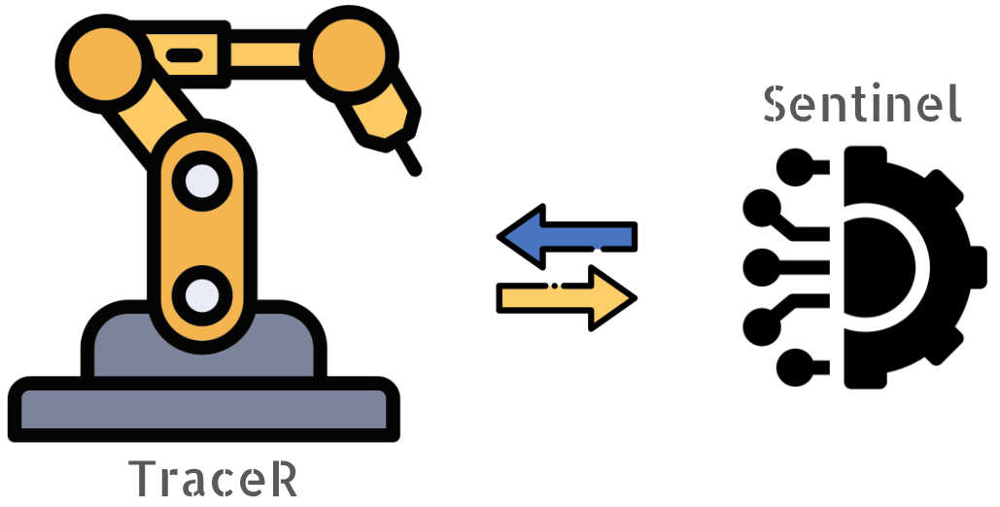
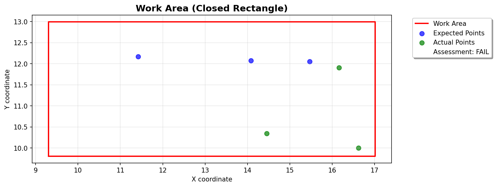

<a id="readme-top"></a>

<!-- PROJECT LOGO -->
<br />
<div align="center">
  <a href="https://github.com/johnjericomcustodio/tracer-sentinel/">
    
  </a>
  <h3 align="center">Sentinel - The Automated Test Framework for Robot Arm TraceR</h3>
</div>

<!-- TABLE OF CONTENTS -->
<details>
  <summary>Table of Contents</summary>
  <ol>
    <li>
      <a href="#about-the-project">About The Project</a>
      <ul>
        <li><a href="#built-with">Built With</a></li>
        <li><a href="#operation-flow">Operation Flow</a></li> 
      </ul>
    </li>
    <li>
      <a href="#getting-started">Getting Started</a>
      <ul>
        <li><a href="#prerequisites">Prerequisites</a></li>
        <li><a href="#installation">Installation</a></li>
      </ul>
    </li>
    <li><a href="#usage">Usage</a></li>
      <ul>
        <li><a href="#test-execution">Test Execution</a></li>
        <li><a href="#test-scenarios">Test Scenarios</a></li>
        <li><a href="#cleanup">Cleanup</a></li>
      </ul>
    <li><a href="#limitations">Limitations</a></li>
    <li><a href="#cicd">CICD</a></li>
    <li><a href="#references">References</a></li>
  </ol>
</details>

## About The Project

### Built With

- Python (pytest framework, Docker)
- Bash
- Ubuntu 24.04.3 LTS

### Operation flow

1. The Sentinel program supplies a *system_input_file.txt* to TraceR using the required format:

```bash
Rectangle
(9.31, 9.8), (17.01, 9.8), (17.01, 13.0), (9.31, 13.0)
Points
(14.09, 12.08)
(11.42, 12.17)
(15.47, 12.05)
```
2. TraceR takes the expected visit points from the input file listed under keyword *Points*
3. TraceR visits points one by one only within the work area defined by the coordinates under the keyword *Rectangle*.
4. TraceR provides the list of actual visited points by writing them in an output file *system_output_file.txt* with the following format:

```bash
(14.45, 10.35)
(16.62, 10.01)
(16.16, 11.9)
```
5. Sentinel digests both the input and output files to verify correctness and compare expected vs. actual visited points.
6. Sentinel determines whether TraceR successfully visited all required points in the exact sequence.
7. Sentinel produces a PASS/FAIL result in *test_results.txt*, along with a plotted image showing the rectangle and all points.

<a href="https://github.com/johnjericomcustodio/tracer-sentinel/">
  
</a>

## Getting Started

### Prerequisites

1. Clone this repo locally by :

```bash
git clone git@github.com:johnjericomcustodio/tracer-sentinel.git
```

2. Change directory and update to latest:

```bash
cd tracer-sentinel
git pull origin main
```

### Installation

1. If this is the first time to run the environment or if there are any code modifications (e.g. in src/helpers.py, tests/test_tracer.py or Dockerfile), (re)build the docker container by:

```bash
./tests/run.sh --build
```

Notes
* This automatically runs code quality checks.

<p align="right">(<a href="#readme-top">back to top</a>)</p>

## Usage

### Test Execution

1. To run all tests :

```bash
./tests/run.sh --test
```

2. To run specific test cases (pytest adds this to its -k argument) :

```bash
./tests/run.sh --test <test scenario identifier>
```
example:
```bash
./tests/run.sh --test pass # runs all test scenarios that are expected to PASS (prefixed with pass_*)
./tests/run.sh --test fail # runs all test scenarios that are expected to FAIL (prefixed with fail_*)
./tests/run.sh --test fail_points_mismatch # runs specific test scenarios prefixed with fail_points_mismatch_*
```


Notes
* pytest adds ```<test scenario identifier>``` to its -k argument
* ```<test scenario identifier>``` is an identifier based on the folders listed in [data/scenarios](data/scenarios)
* Results are stored individually to their corresponding folders in [data/scenarios](data/scenarios). These include the timestamped test_results.txt as well as the plot png file to visualize the coordinates.

### Test Scenarios

Test scenarios are found in [data/scenarios](data/scenarios). To add tests:
1. Go to [data/scenarios](data/scenarios)
2. Create a new directory with folder name prefixed with either pass_ or fail_. This is used to indicate if the test is expected to PASS or FAIL.
3. Each folder contains 2 files required as input to Sentinel:
- system_input_file.txt
- system_output_file.txt
4. After test execution, a test_results.txt is generated in the corresponding test scenario. Sample format is shown below:

```bash
======================================================================
OVERALL TEST STATUS: PASS
======================================================================

POINT-BY-POINT COMPARISON:
----------------------------------------------------------------------
Expected Points      Actual Points        Assessment
-------------------------------------------------------
(1.41, 6.38)         (1.41, 6.38)         PASS      
(2.49, 9.08)         (2.49, 9.08)         PASS      
(0.94, 7.06)         (0.94, 7.06)         PASS      
(1.9, 8.41)          (1.9, 8.41)          PASS      
(2.3, 5.65)          (2.3, 5.65)          PASS      
(1.29, 3.91)         (1.29, 3.91)         PASS      
```

5. Additionally, if all parsed data are valid, a visualization (png file) is generated showing the work area boundary along with the expected and actual coordinate points.


### Cleanup

To cleanup test result files from previous runs:

```bash
./tests/run.sh --cleanup
```
<p align="right">(<a href="#readme-top">back to top</a>)</p>

## Limitations

1. The work area defined by the rectangle points is assumed to be axis aligned. The existing algorithm needs to be updated to check presence of points in non-axis aligned/rotated quadrilaterals.
2. Random generation of coordinates is nice to have but not yet implemented.
3. The test environment is only confirmed working in an Ubuntu system. Given that the environment is Docker based, however, running this on Windows shouldn't post any issue.

<p align="right">(<a href="#readme-top">back to top</a>)</p>

## CICD

<a href="https://github.com/johnjericomcustodio/tracer-sentinel/">
  
</a>

- Integrating this to a CICD pipeline, a dedicated robot arm TraceR will be used as the automation agent.
- For any system update available, TraceR will then be triggered to upgrade/downgrade followed by the execution of the validation program Sentinel.
- Sentinel performs the standard ***Feed → Digest → Verify*** sequence on every test input it provides to TraceR and generates a Pass/Fail report.
- A plot will also be generated to visualize TraceR's work area and map the actual versus expected visit points.
- By default, Sentinel uses predefined test inputs to validate TraceR, but it can potentially generate random inputs for reliability and performance testing.

<p align="right">(<a href="#readme-top">back to top</a>)</p>

## References

- [README template](https://github.com/othneildrew/Best-README-Template/blob/main/README.md)
- [Markdown Guide](https://www.markdownguide.org/basic-syntax/)
- [Photopea](https://www.photopea.com/)
- [Flaticon](https://www.flaticon.com/)

<p align="right">(<a href="#readme-top">back to top</a>)</p>
