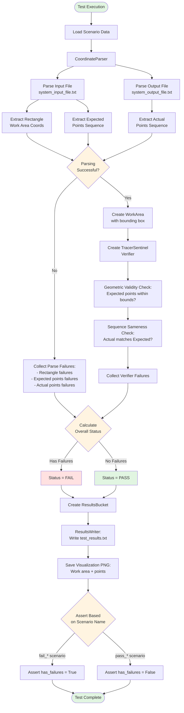

# Test Flow Diagram

## Flow Description

### 1. Input Phase
- Load scenario data from test directory
- Initialize CoordinateParser with input/output file paths

### 2. Parsing Phase
- **Input File**: Extract rectangle coordinates and expected points sequence
- **Output File**: Extract actual points sequence
- Track parsing failures for each section

### 3. Validation Phase
- Check if parsing was successful
- If successful, create WorkArea and TracerSentinel verifier
- Run geometric validity check (points within bounds)
- Run sequence sameness check (actual matches expected)

### 4. Results Phase
- Collect all failures (parsing + verification)
- Calculate overall status (PASS/FAIL)
- Write results to `test_results.txt`
- Save visualization PNG with work area and points

### 5. Assertion Phase
- Validate that fail scenarios produce failures
- Validate that pass scenarios have no failures
